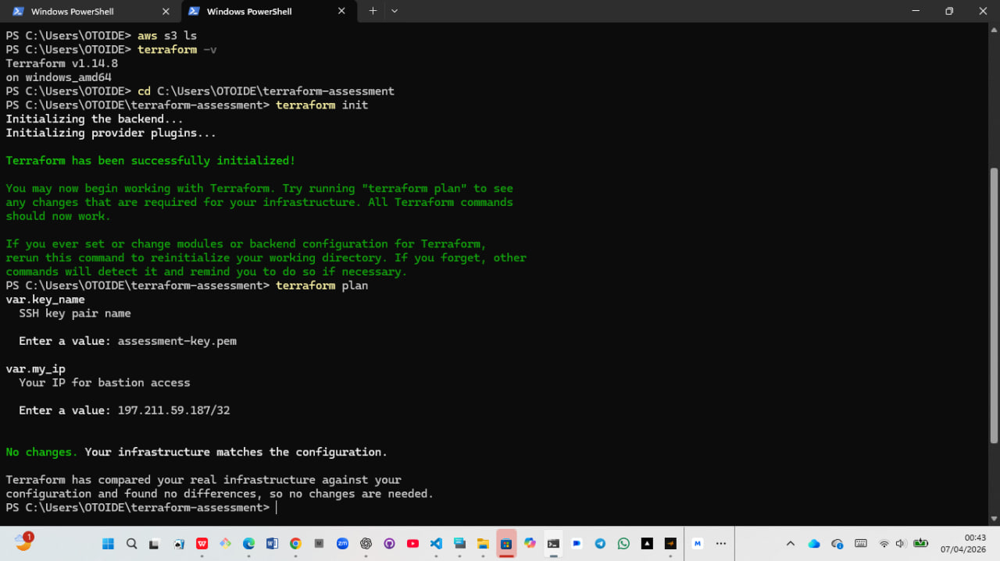
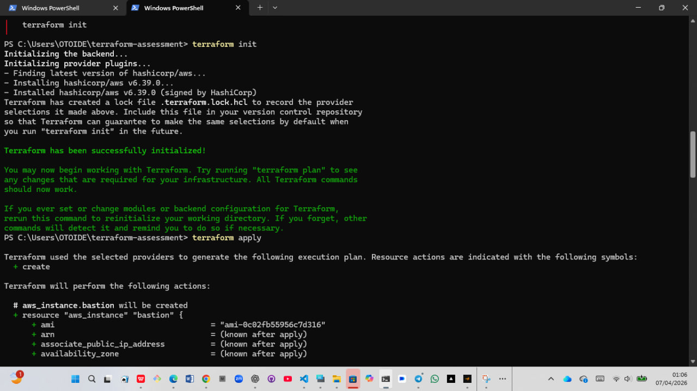
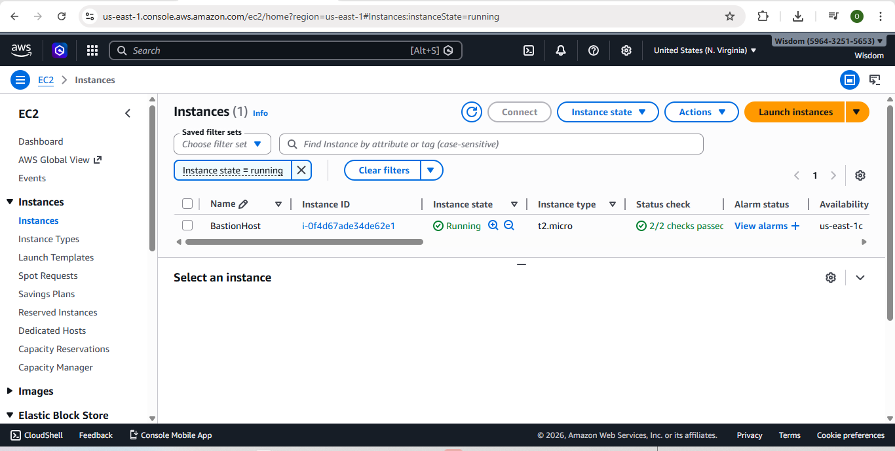
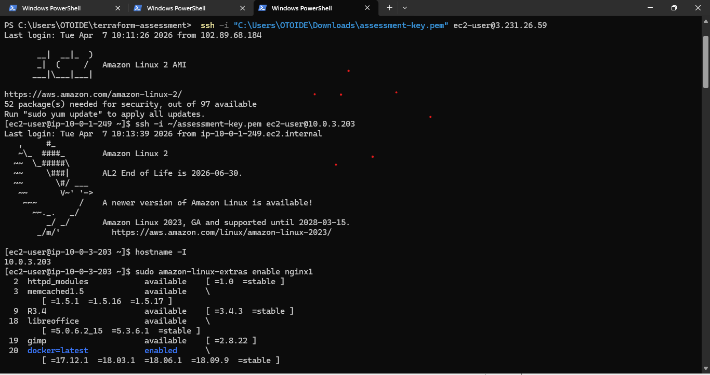
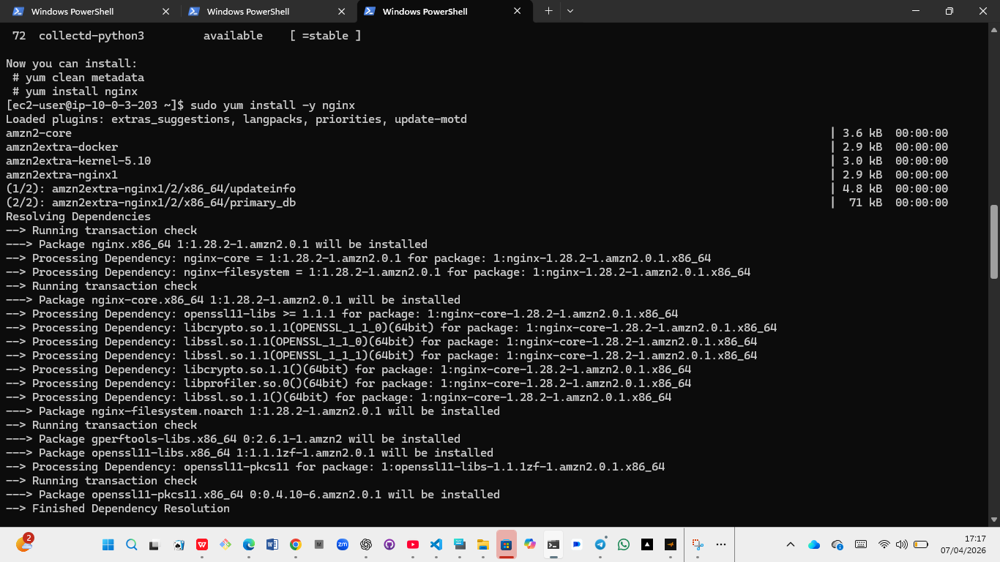
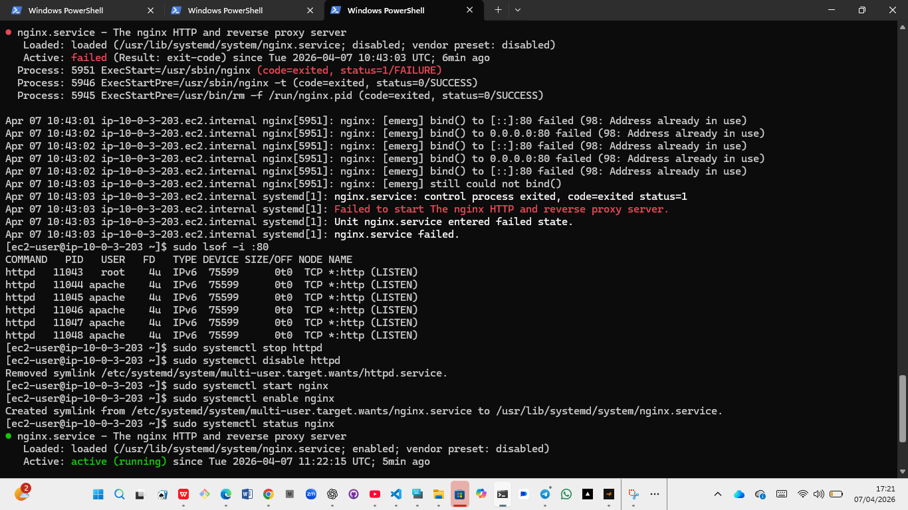
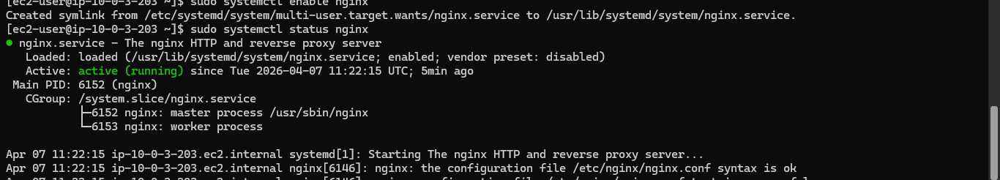
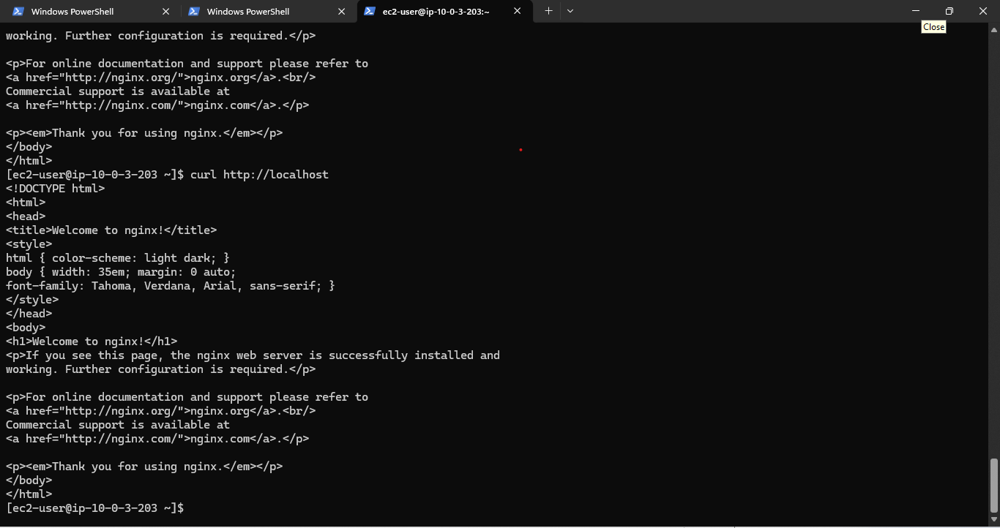

# Terraform AWS Web Server Project

## 📌 Overview

This project demonstrates how to provision a secure AWS infrastructure using Terraform, including a bastion host and a private EC2 instance running Nginx.

---

## ⚙️ Technologies Used

* Terraform
* AWS EC2
* Amazon Linux 2
* Nginx

---

## 🏗️ Architecture

* Bastion Host (Public Subnet)
* Private EC2 Instance (Private Subnet)
* SSH access via Bastion
* Web server hosted privately

---

## 🚀 Deployment Steps

### 1. Terraform Plan

---

### 2. Terraform Apply

---

### 3. EC2 Instances Running

---

### 4. SSH Access via Bastion Host

---

### 5. Install Nginx

---

### 6. Troubleshooting (Port 80 Conflict)

Stopped Apache (httpd) to free port 80 for Nginx.

### 7. Nginx Running

---

### 8. Verification (Web Server Output)

---

## ✅ Result

* Successfully deployed infrastructure using Terraform
* Configured secure SSH access using a bastion host
* Installed and configured Nginx on a private EC2 instance
* Resolved port conflict issue
* Verified web server functionality using curl

---

## 🎯 Conclusion

This project demonstrates a complete DevOps workflow including infrastructure provisioning, secure access, server configuration, and troubleshooting.
